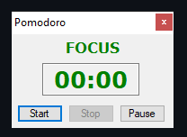

# Beeminding Pomodoros using AHK & JavaScript
## This project was created to track pomodoros done daily using an integration of [node-pushover](https://github.com/SamDecrock/node-pushover) and AHK.

* Track pomodoros done daily with Beeminder goal updates & pomodoros logging.
* Ability to send push notifications using Pushover.
* Very easy to customize to your needs.

## Requirements
— A [Beeminder](https://www.beeminder.com/) account.
<br>— A [Pushover](https://pushover.net/) account. [Optional if you don't want push notifications]
<br>— AHK Version: [1.1.36.02](https://github.com/AutoHotkey/AutoHotkey/releases/tag/v1.1.36.02/AutoHotkey/AutoHotkey/releases/download/v1.1.36.02/AutoHotkey_1.1.36.02_setup.exe)


## Installation & Usage
1) Clone the repository `git clone https://github.com/itscae/BeeminderWithAHK.git`
2) Open `config.json` file to add the necessary information and turn off/on toggles.
- pushover: Boolean to determine whether to send push notifications.
- beeminder: Boolean to determine whether to update a goal on Beeminder.
- playSounds: Boolean to play sounds when timers end.
- changeIcons: Boolean to determine whether to change icons depending on script's status.
- bmAuthToken: Put your Beeminder Authorization Token here.
- bmGoalName: Put your goal name here. <br>(Example: beeminder.com/alice/**weight**) <-- Goal name.
- pushAuthToken: Put your Pushover Authorization Token here. **(Optional)**
- pushUserId: Put your Pushover User ID here. **(Optional)**
```json
{
    "pushover": false,
    "beeminder": false,
    "playSounds": false,
    "changeIcons": true,
    "bmAuthToken": "tokenHere",
    "bmGoalName": "goalHere",
    "pushAuthToken": "tokenHere",
    "pushUserId": "userIdHere"
}
```
3) Run `index.ahk` to start the script.
Every 25 minutes, the script will send a goal update request using Beeminder's API and will also log the pomodoro count in a file defined by the current date. The script will then switch to a 5 minute timer, which counts as a break. Afterwards, the timer stops and resets; by then you can start another Pomodoro.<br>


## Credits
[cocobelgica](https://github.com/cocobelgica/AutoHotkey-JSON) - AHK JSON Parser.
<br>[SamDecrock](https://github.com/SamDecrock/node-pushover) - Node.js module for Pushover.
<br>[malcolmocean](https://github.com/malcolmocean/beeminderjs) - Node.js module for Beeminder.
